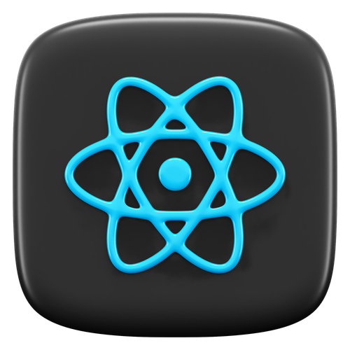

  

###

 
 

  
  
  
  

 
 

###

<h1 align="center">Welcome, Enjoy! </h1>

###

<h3 align="left">  About Me</h3>

###

      <h4>
        Front-end web developer experience in building and maintaining
        user-friendly and interactive web applications. Proven ability to
        utilize HTML, CSS, and JavaScript to create visually appealing and
        responsive websites. Expertise in using popular front-end development
        frameworks.
      </h4>
       
      <h2> Why Me?</h2>
      <ol>
        <li>
          Passionate about developing innovative and user-centric web
          experiences.
        </li>
        <li>Strong problem-solving and analytical skills.</li>
        <li>Ability to work independently and as part of a team.</li>
        <li>Excellent communication and interpersonal skills.</li>
        <li>Commitment to continuous learning and development.</li>
      </ol>
      <h2> Skills</h2>
      <ul>
        <li> HTML</li>
        <li> CSS</li>
        <li> JavaScript</li>
        <li> React JS</li>
        <li> Tailwind CSS</li>
        <li> Git</li>
        <li> GitHub</li>
      </ul>
      <h2> Why I am a skilled front-end web developer</h2>
      <ol>
        <li>
          I have a strong understanding of the fundamentals of web development,
          including HTML, CSS, and JavaScript.
        </li>
        <li>I am able to write clean, efficient, and maintainable code.</li>
        <li>
          I am committed to continuous learning and development, and I am always
          looking for new ways to improve my skills.
        </li>
        <li>
          I am eager to use my skills and experience to contribute to a team and
          help develop innovative and user-centric web products.
        </li>
      </ol>
    

###

<h3 align="left">  Language and tools</h3>

###

  
  
  
  
  
  
  
  
  
  
  
  
  
  
  

###

  

###
